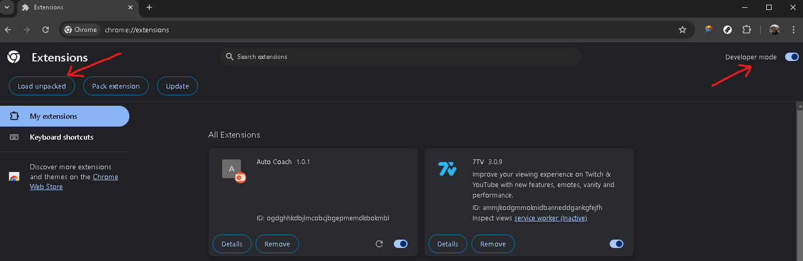
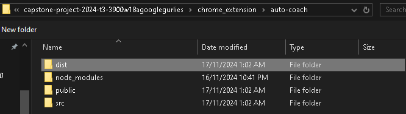

# Running the Application
Installation Manual<br/>
To launch the main application, clone the repository:

<code>git clone https://github.com/unsw-cse-comp99-3900/capstone-project-2024-t3-3900w18agooglegurlies.git</code>


Then change into the root directory of the repository and run the command:

<code>docker compose up --build</code>


Then wait for the system to load and once it is finished it can be found at:

http://localhost:5173/


Note: An HTTPS implementation can be found commented out in the code, (server.ts + docker compose files + config files). Once a domain is obtained, certbot can be used to generate an SSL token and from there, the HTTPS implementation can be uncommented to run the server on HTTPS.

Import information for testing:

For testing purposes, the database is cleared and refreshed with test users every time docker compose up -- build is run. In order to stop this and have the database persist, simply remove the first line (or comment it out) of database/db.sql, which drops the database every time.


There are a few notes that one should take notice of:
- Ensure Docker is installed and running on your machine.
- Make sure you have the necessary environment variables set up.
- Check that the required ports are not in use by other applications.

# Chrome Extension - Auto Coach
This section details how to build and use the Chrome Extension to auto-fill participant details into the ICPC Global system.

1. Navigate to chrome_extesion/auto-coach/ from root directory and compile the extension, which should give you a chrome_extesion/auto-coach/dist/ directory :
```bash
# (in chrome_extesion/auto-coach/ directory)
npm run build
```
2. Navigate to chrome://extensions (paste this into your Chrome search bar) and turn on Developer mode. Then click "Load unpacked".


3. "Load unpacked" button will prompt you to select a folder to upload from which to build a Chrome Extension. You should navigate to the location of the recently built dist folder and upload it.


4. The Chrome Extension should be functional by now. Here is a [video](https://drive.google.com/file/d/1xJ0_18Eu4yHZIVSpzBAizO9cungVHPIk/view?usp=sharing) demonstrating how to use it.
